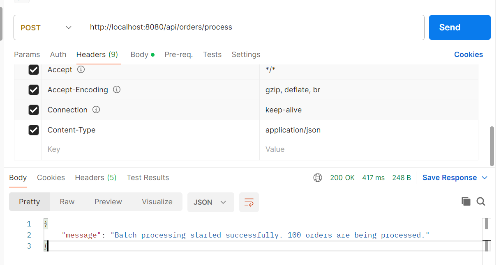

use postman endpoint
http://localhost:8080/api/orders/process
payload
{
"filePath": "C:/Users/user/Downloads/orders.csv"
}
header:             key:
Content-Type        application/json

use H2 db with url
http://localhost:8080/h2-console
jdbc url: jdbc:h2:mem:bulkorderdb;DB_CLOSE_DELAY=-1;DB_CLOSE_ON_EXIT=FALSE
username: sa
password: 
